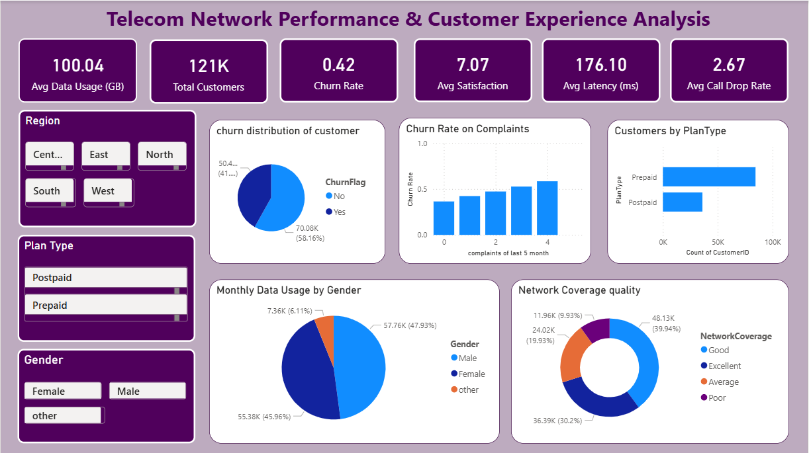

# Telecom-Network-Performance-Customer-Experience-Analysis-Power-BI-Project
Developed an interactive Power BI dashboard to analyze telecom network performance and customer experience. Assessed churn, satisfaction, latency, call drops, data usage, and complaints across regions, plans, payment methods, and devices to enable data-driven insights for service optimization and customer retention.

## Dashboard Preview

### Overview

### Network Performance

### Customer Experience

